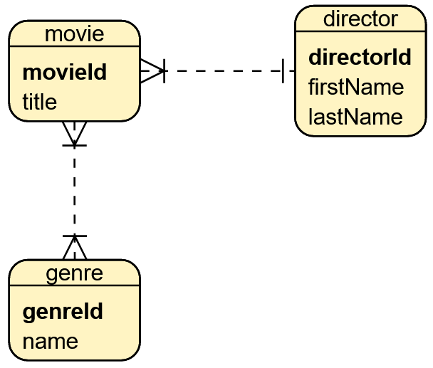

# Hibernate 5 Demo

Ejemplo minimal y comentado del setup de Hibernate con JPA, usando MySQL.

Para poder ejecutar el ejemplo es necesario configurar adecuadamente las credenciales (usuario y contraseña) con las cuales se accederá a la base de datos, así como indicar el URL de la misma. Esta configuración se proporciona en el archivo [persistence.xml](./src/main/resources/META-INF/persistence.xml). También es necesario haber creado en MySQL una base de datos vacía (sin tablas) con el nombre configurado.

## Diseño de la base de datos

El sistema implementa un diseño con tres entidades, una asociación "muchos a muchos" y otra asociación "uno a muchos".

  

